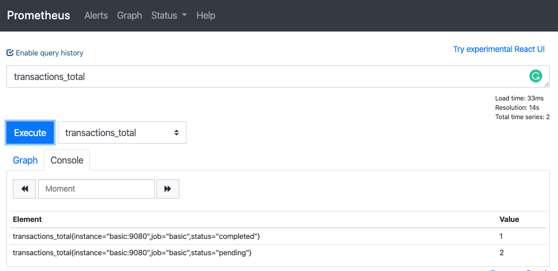
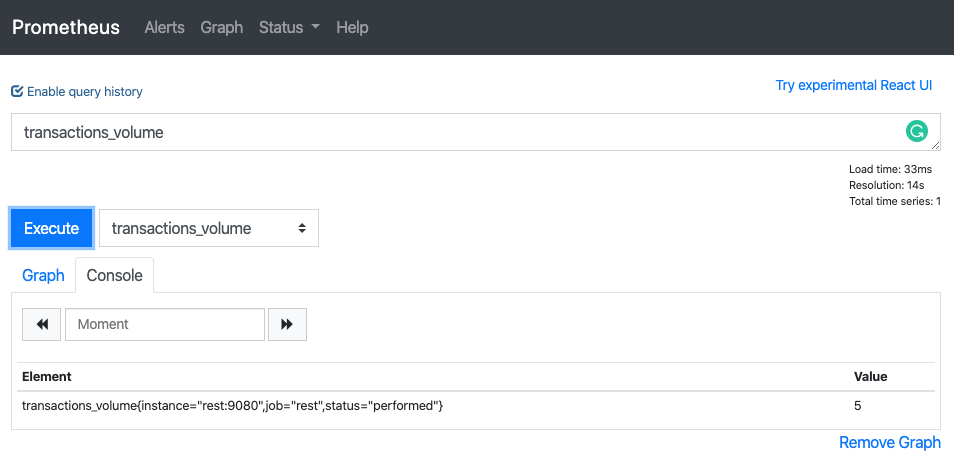

# Opentelemetry Prometheus metrics demo


[](http://github.com/syl20bnr/spacemacs)

There are two directories with Go code to demonstrate how to use Opentelemetry to export metrics in Prometheus format.

# Quick Start

## Minimal requirements
- [Go](https://golang.org/dl/) 1.13

## For `basic` example:

Enter in the desired directory `basic/`

`cd basic`

Run `go run main.go`

Access http://localhost:9080/metrics and you see an output like this:

```txt
# HELP transactions_total 
# TYPE transactions_total counter
transactions_total{status="completed"} 1
transactions_total{status="pending"} 2
```

These are metrics in the format accepted by Prometheus

## For `rest` example:

Enter in the desired directory `rest/`

`cd rest`

Run `go run main.go`

Access http://localhost:3000/transactions and you see a `OK` message that will increase a counter named `transactions_volume` every time you refresh the page.

Access http://localhost:9080/metrics and you see an output like this:

```txt
# HELP transactions_volume 
# TYPE transactions_volume counter
transactions_volume{status="performed"} 24
```

These are metrics in the format accepted by Prometheus

# Advanced Start

## Requirements
- [Go](https://golang.org/dl/) 1.13
- [Docker](https://www.docker.com/get-started)
- [docker-compose](https://docs.docker.com/compose/install/)
- [Bazel](https://docs.bazel.build/versions/master/install.html) 2.2.0

## With Docker

### For `basic` example:

```shell
docker build -t basic -f basic/Dockerfile ./basic/

docker run -p 9080:9080 basic
```

### For `rest` example:

```shell
docker build -t rest -f rest/Dockerfile ./rest/

docker run -p 9080:9080 -p 3000:3000 rest
```

## With Bazel

### For `basic` example:

Build and run: 

```shell
bazel build //basic

bazel-bin/basic/basic
```

### For `rest` example:

Build and run: 

```shell
bazel build //rest

bazel-bin/basic/rest
```

## With Bazel + Docker (The fun way)

To generate a container image you need to run:

```shell

bazel run //basic:latest

bazel run //rest:latest
```
Note: `go_image` cannot be used from Bazel running on a Mac. Other rules may also fail arbitrarily on Mac due to unforseen toolchain issues that need to be resolved in Bazel and upstream rules repos. Please see [#943](https://github.com/bazelbuild/rules_docker/issues/943) for more details. 
If you only have a Mac machine you could run this command inside a docker container running:

```shell
   docker run -it --entrypoint bash -v $PWD:/opt -v /var/run/docker.sock:/var/run/docker.sock l.gcr.io/google/bazel:2.2.0
   cd opt
   bazel run //basic:latest
   bazel run //rest:latest
```

To run all services and a Prometheus instance run:

```shell

docker-compose up

```

Access http://localhost:3000/transactions and you see a `OK` message that will increase a counter named `transactions_volume` every time you refresh the page.

Access http://localhost:9090 and you see the Prometheus interface with the services configured as targets.

- `transactions_total`



- `transactions_volume`


